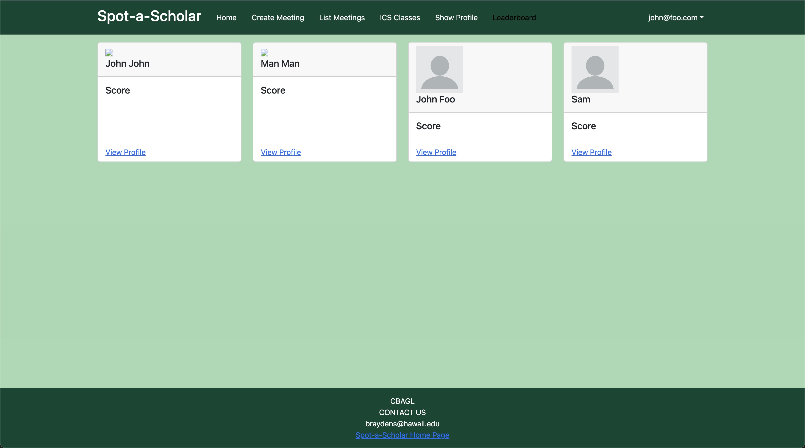

## Spot a Scholar 
[View on Github](https://github.com/spot-a-scholar)

## Table of Contents
* [Overview](#overview)
* [Goals](#goals)
* [User Guide](#user-guide)
* [Deployment](#deployment)
* [Milestones](#milestones)
* [Team](#team)

## Overview

Spot a Scholar is an application that organizes student-led study sessions for courses. This allows for people to both teach and learn from one another.

There will be a section that will list ICS courses, and within this course, the users can see both the tutors and the ones who need tutoring. Users can then contact each other through the app to set up a time and place to meet within ICSpace. There will be an online calendar to show the meetings and who is attending.

Spot a scholar can be used to schedule a study session, or to find a tutor who is available to help with the problem you are having at the current moment.

## Goals

The goal is to encourage face-to-face study groups and peer mentorship to enhance how students learn material for their courses. This can be done by providing an easy-to-use and streamlined application where setting up these sessions is quick and simple. However, there may be a psychological barrier to getting students to ask for help. As a solution, an incentive/reward system can be implemented that rewards users who participate in sessions. What this entails is still up for discussion. 

## User Guide

This section provides information on the user interface and features of our application.

### Landing Page
This is the first page everyone sees when they view our website.  

___

### Sign Up Page
Here users can create an account, allowing access to the features of Spot a Scholar. After creating an account, the user will be directed to the user profile page where they'll be able to edit their profile.

___

### Login Page
Returning users who have already created accounts can log in here.

___

### Home Page
Logged-in users see this page with all available features

___

### User Profile Page
Here, users can edit their profiles by changing their pictures, current courses, class standing, etc. 

This is the create user profile page.

This is what the show user profile page currently looks like. It displays the user's information in a card, and has an edit button to edit the profile.

___

### ICS Section Page
Users can view the various ICS classes, as well as the professors and students that are associated with each class. Users can click on a particular ICS class that takes them to the Create Meeting page, to create a meeting for that specific class.

___

### Create Meeting Page
Users can schedule a meeting date, location for hosting, and material they are planning on studying.

This is an example of what the Create Meeting Page might look like

___

### List Meetings Page
Users can view all scheduled meetings, join desired meetings, and view participants of the meeting.

___

### Leaderboard Page
When users create meetings, they gain points. The top point scorers are displayed on the leaderboard to incentivize collaboration.

___

### Admin Meeting List Page
A page for authorized users to view all meetings and remove them from the system.

___

### Feedback
Scoring (Out of 5): 
 
Tanner O. 
Aesthetic: 5 
Functionality: 5 !
Ease of Use: 5 
Comments: This is a heater 
 
Colby C:  
Aesthetic: 4 
Functionality: 4 
Ease of Use: 5 
Comments: Good enough cause even I know how to use it 
 
Velika Y: 
Aesthetic: 3 
Functionality: 5 
Ease of Use: 5 
Comments: Nice concept 
 
Joshua A: 
Aesthetic: 4 
Functionality: 5 
Ease of Use: 5 
Comments: Banger app 
 
Sherise P: 
Aesthetic: 3 
Functionality: 5 
Ease of Use: 5 
Comments: Whoever picked these colors needs to be replaced 

## Deployment
Spot-a-Scholar is deployed on digital ocean [here](http://161.35.229.168)

## Milestones

### [Milestone 1](https://github.com/orgs/spot-a-scholar/projects/1/views/1)
### [Digital Ocean Deployment](http://161.35.229.168)
### [Milestone 2](https://github.com/orgs/spot-a-scholar/projects/5/views/1)
### [Milestone 3](https://github.com/orgs/spot-a-scholar/projects/6/views/1)

## Team
Spot a Scholar was created by [Adrian Peng](https://github.com/AdrianPeng02), [Brayden Suzuki](https://github.com/braydens02), [Carl Domingo](https://github.com/carld20), [Gavin Ng](https://github.com/Ng-Gavin), and [Leo Liang](https://github.com/leoliang22). All members have agreed to the team contract found [here](https://docs.google.com/document/d/1xYJmXnE_EMxqvXJQP85zjtr-adYrsPa7Yv8gQr9Bpp4/edit)

