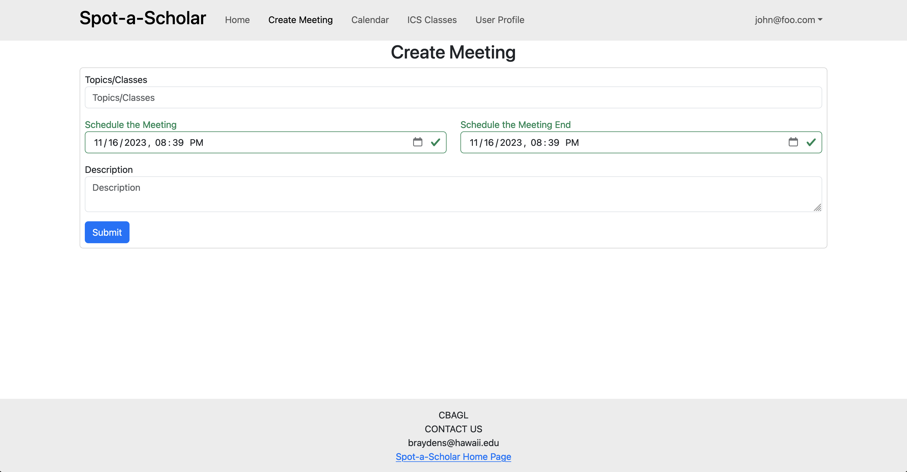

## Spot a Scholar

## Table of Contents
* [Overview](#overview)
* [Goals](#goals)
* [User Guide](#user-guide)
* [Milestones](#milestones)
* [Team](#team)

## Overview

Spot a Scholar is an application that allows users to start study sessions for courses. This allows for people to both teach and learn from each other. Users must provide a photo so that other users can identify them.

There will be a section that will list ICS courses, and within this course, the users can see both the tutors and the ones who need tutoring. Users can then contact each other through the app to set up a time and place to meet within ICSpace. There will be an online calendar to show the meetings and who is attending.

Spot a scholar can be used to schedule a study session, or to find a tutor who is available to help with the problem you are having at the current moment.

## Goals

Since there is a barrier in getting students to ask for help, there can be some sort of reward system to be implemented in the future. What this exactly entails is still up for discussion.

## User Guide

This section provides information on the user interface and features of our application.

### Landing Page
This is the first page everyone sees when they view our website.  

___

### Sign Up Page
Here users can create an account, allowing access to the features of Spot a Scholar.

This is an example of what the signup page will look like

___

### Login Page
Returning users who have already created accounts can log in here.

This is an example of what the login page will look like

___

### Home Page
Logged-in users see this page with all available features

___

### User Profile Page
Here, users can edit their profiles by changing their pictures, current courses, class standing, etc. 

This is an example of what the User Profile Page might look like

___

### ICS Section Page
Users can view the various ICS classes, as well as the professors and students that are associated with each class. Users can click on a particular ICS class that takes them to the Create Meeting page, to create a meeting for that specific class.

___

### Create Meeting Page
Users can schedule a meeting date, location for hosting, and material they are planning on studying.

This is an example of what the Create Meeting Page might look like

___

### Calendar Page
Users can view all scheduled events in a calendar format and request to join desired sessions

___

### Admin Calendar Page 
A page for authorized users to view all scheduled events in a calendar format and remove/cancel sessions

___

### Admin User List Page
Page for authorized users to view all users and remove them from the system

___
## Milestones

### [Milestone 1](https://github.com/orgs/spot-a-scholar/projects/1/views/1)
### Milestone 2
### Milestone 3

## Team
Spot a Scholar was created by [Adrian Peng](https://github.com/AdrianPeng02), [Brayden Suzuki](https://github.com/braydens02), [Carl Domingo](https://github.com/carld20), [Gavin Ng](https://github.com/Ng-Gavin), and [Leo Liang](https://github.com/leoliang22). All members have agreed to the team contract found [here](https://docs.google.com/document/d/1xYJmXnE_EMxqvXJQP85zjtr-adYrsPa7Yv8gQr9Bpp4/edit)
